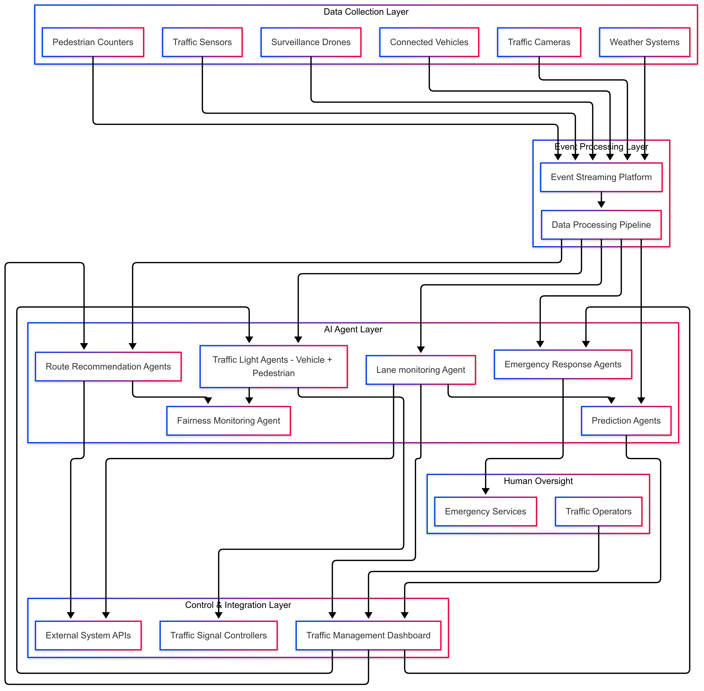

# **Multi-Agent System for Smart Traffic Management**

## Agent Types and Responsibilities

### 1. Traffic Light Agents (TLA)

-Autonomously adjust signal timing based on real-time traffic conditions
-Coordinate with neighboring intersections to create "green waves"
-Adaptively prioritize directions with higher congestion
-Maintain state awareness of previous decisions for consistent optimization

### 2. Route Recommendation Agents (RRA)

-Analyze citywide traffic patterns to suggest optimal routes
-Communicate with vehicles through V2I (Vehicle to Infrastructure) protocols
-Balance route distribution to prevent creating new congestion points
-Consider vehicle types and passenger counts for fairness

### 3. Emergency Response Agents (EMA)

-Create dynamic emergency corridors for ambulances, fire trucks, and police
-Coordinate with TLAs to preemptively adjust signals along emergency routes
-Track emergency vehicle progress and restore normal operations after passage
-Maintain priority queuing when multiple emergency vehicles are present

### 4. Prediction Agents (PA)

-Forecast traffic patterns based on historical data, weather, and events
-Identify potential congestion hotspots before they form
-Provide decision support to other agents with forward-looking insights
-Learn from prediction accuracy to continuously improve models

### 5. Fairness Monitoring Agent (FMA)

-Ensure equitable distribution of wait times across neighborhoods
-Monitor for and correct bias in route recommendations
-Track accessibility metrics for pedestrians and public transportation
-Generate fairness reports for transparency and accountability

### 6. Lane Monitoring Agent (LMA)

-Oversees any slow moving vehicle and predicts any forthcoming traffic delays
-Monitor for unusual driver activity
-Detects speeding or racing vehicles and notify the authorities
-Detects jay walking

## System Architecture Overview

## State Preservation Mechanism

Each agent maintains its state through a combination of:

### 1. Persistent Event Store

All events and agent decisions are recorded in a distributed event log
Enables replay of event sequences for recovery and audit purposes
Supports event sourcing pattern for agent state reconstruction

### 2. State Snapshots

Agents periodically create checkpoints of their internal state
Includes decision history, learned patterns, and current operational context
Allows quick recovery after restarts without full event replay

### 3. Real-time State Synchronization

Critical state information is replicated across redundant agent instances
Enables seamless failover with minimal disruption to traffic management
Leverages consensus protocols for consistent state across distributed agents

## Human-in-the-Loop Integration

Human operators interact with the system through:

### Approval Workflows

Critical decisions require human approval before implementation
Tiered approval levels based on impact and urgency
Auto-approval of low-risk decisions with human notification

### Manual Override Capabilities

Operators can override any AI agent decision when necessary
Direct traffic light control for special events or emergencies
Ability to place constraints on AI decision boundaries

### Monitoring and Feedback

Real-time visualization of traffic patterns and agent decisions
Historical performance analytics and anomaly highlighting
Feedback loop for operators to rate and improve agent decisions

## System Integration Architecture

The multi-agent system integrates with existing infrastructure through:

### Adapters for Legacy Systems

Hardware abstraction layer for different traffic signal controllers
Protocol translation between modern and legacy communication systems
Gradual capability enhancement without full infrastructure replacement

### Standardized APIs

RESTful and event-based interfaces for external system communication
Documented integration points for municipal systems and third parties
Secure authentication and authorization mechanisms

### Simulation Environment

Digital twin of the urban environment for testing agent behaviors
What-if scenario planning for unusual situations
Training ground for new agent capabilities before deployment

## Ethical and Responsible AI Implementation

Ethical Framework for Smart Traffic ManagementDocument 
The system implements responsible AI through:

### Fairness by Design

Continuous monitoring of wait times across different neighborhoods
Algorithmic constraints to prevent creating "sacrifice zones"
Regular auditing of traffic distribution patterns for hidden biases

### Transparent Decision-Making

Explainable AI approaches for all traffic management decisions
Public dashboards showing system performance metrics
Clear attribution of decisions to specific agents and criteria

### Privacy Protection

Anonymization of all vehicle and pedestrian data
Strict data retention policies and minimization practices
Privacy-preserving machine learning techniques

### Security Measures

Robust protection against tampering and manipulation
Intrusion detection for potential attacks on infrastructure
Regular security audits and penetration testing

## Simulation and Testing Approach

To validate the system before full deployment:

### Digital Twin Environment

Realistic simulation of urban traffic patterns
Integration of real-world traffic data for calibration
Agent behavior testing across diverse scenarios

### Scenario Testing

Rush hour congestion management
Emergency vehicle response optimization
Weather event adaptations
Mass event handling (sports, concerts)
Infrastructure failure resilience

### Gradual Deployment

Pilot implementations in limited areas
A/B testing of agent strategies
Incremental capability rollout with careful monitoring
